Tags: #mediq
Created: 2022-10-17 14:10
References: 

# MediQ new instance
This documents describes the process of creating a new instance of MediQ.

## Containers config
This section contains information acout configuring the Docker containers when deploying them.

### Frontend
The frontend container needs to have the following environment variables set:

``` sh
API_URL # the API URL, including '/api'
KEYCLOAK_CLIENT_ID # name of the keycloak client
KEYCLOAK_REALM_NAME # name of the keycloak realm
KEYCLOAK_URL # keycloak URL
COPYRIGHT_HOLDER # footer copyright
```

`KEYCLOAK_REALM_NAME` should be set to the value `hibyte-client`, for simplicity.

The values that are set to the FE container are going to be used for BE's configuration and for the realm creation and configuration.

### Backend
The backend container has much more configurable options. This document will only include the more important ones:

```sh
KEYCLOAK_MP_REST_URI # keycloak URL, which ends with '/auth/admin/realms'
APP_KEYCLOAK_REALM # the realm where accounts get imported
MP_JWT_VERIFY_PUBLICKEY_ISSUER # the URL of the public key issuer, ending in the realm name
MP_JWT_VERIFY_PUBLICKEY_LOCATION # the URL from which the JWT public key can be acquired
JAVAX_SQL_DATASOURCE_MEDIQDATASOURCE_DATASOURCE_URL # jdbc URL of databse
JAVAX_SQL_DATASOURCE_MEDIQDATASOURCE_DATASOURCE_USER # postgres user
JAVAX_SQL_DATASOURCE_MEDIQDATASOURCE_DATASOURCE_PASSWORD # postgres password

#------v required for capesaro sync to work v------#
APP_BASEURL # the base url of the deployed instance (used by capesaro sync)
CAPESARO_SYNC_MP_REST_URI # url of the capesaro sync instance
```

The only values the **MUST** be set are `APP_KEYCLOAK_REALM` and `MP_JWT_VERIFY_PUBLICKEY_ISSUER` and `MP_JWT_VERIFY_PUBLICKEY_LOCATION`.

The other environment variables have the following default values:
- `KEYCLOAK_MP_REST_URI` = https://keycloak.hq-hydra.hibyte.ro/auth/admin/realms
- `JAVAX_SQL_DATASOURCE_MEDIQDATASOURCE_DATASOURCE_URL` = jdbc:postgresql://postgres:5432/mediq
- `JAVAX_SQL_DATASOURCE_MEDIQDATASOURCE_DATASOURCE_USER` = test
- `JAVAX_SQL_DATASOURCE_MEDIQDATASOURCE_DATASOURCE_PASSWORD` = test

## Keycloak realm creation
This section describes the process of creating and configuring a new Keycloak realm for a new MediQ instance.

First off, you need to create a new realm in Keycloak. For this example, the new realm will be called `sample`.

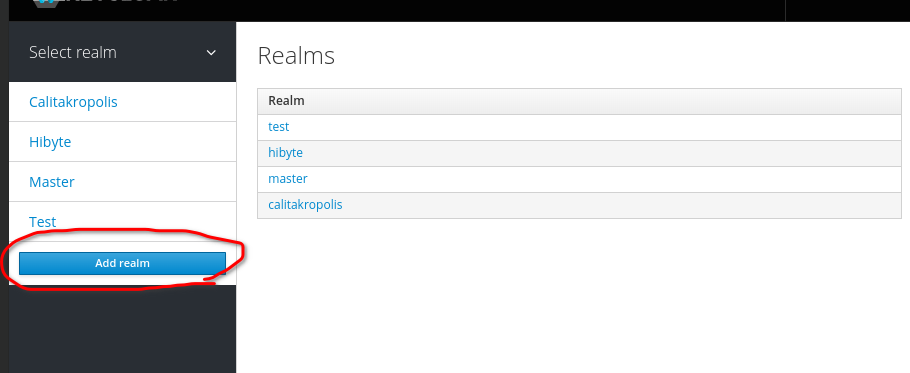

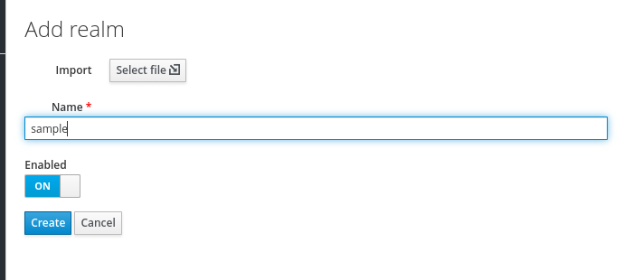

### Creating a client
Next up, you need to navigate to the **Clients** entry in the side menu and create a new client called `hibyte-client`.

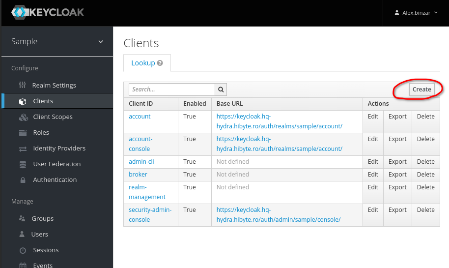

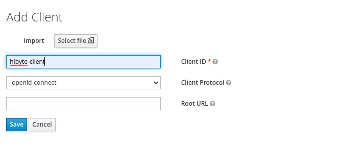

Some additional configuration must be done after creating the client. The properties that need to be set/changed are as follows:
- *Valid Redirect* URIs = https://keycloak.hq-hydra.hibyte.ro/auth/realms/hibyte/account/
- *Web Origins* (CORS) = *

Another thing that you might want to set is the lifespan of the access token. This property can be found under the *Advanced settings* section at the *Access Token Lifespan* field.

### Creating a role
Once you've finished configuring the client, you need to create the roles and set their attributes. To do this, you do the following:

Select the *Clients* entry in the side navigation menu:
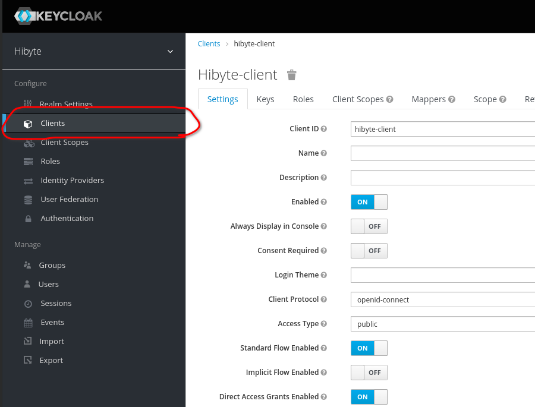

Select the newly created client - *hibyte-client* - in the table:
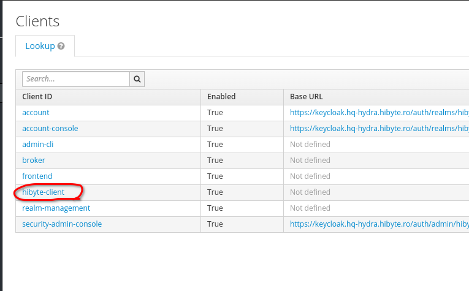

Go to the *Roles* section of the client:
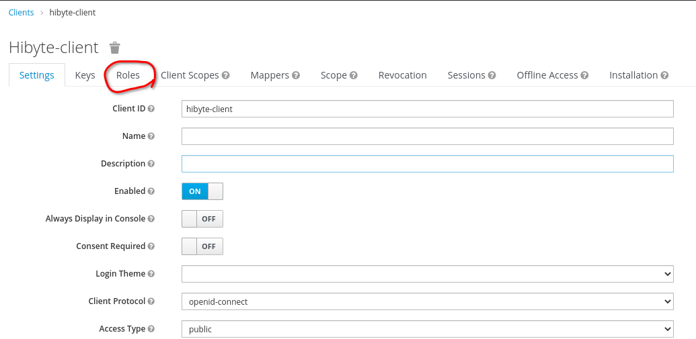

From here, you can create a new role by clicking on the *Add Role* button:
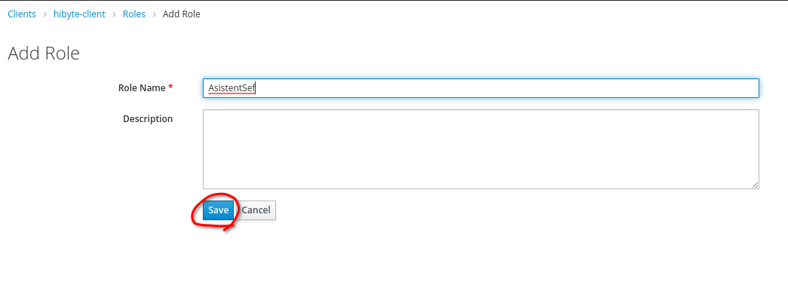

### Setting the role's attributes
Next up, you need to go to the *Attributes* section of the created role:
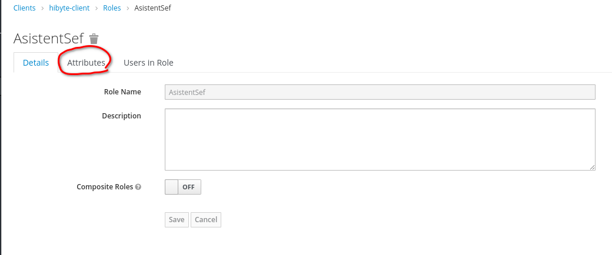

Here, you need to add all the attribute properties. After filling in a key-value pair, in order to obtain a new pair of fields you need to click on the *Add* button:
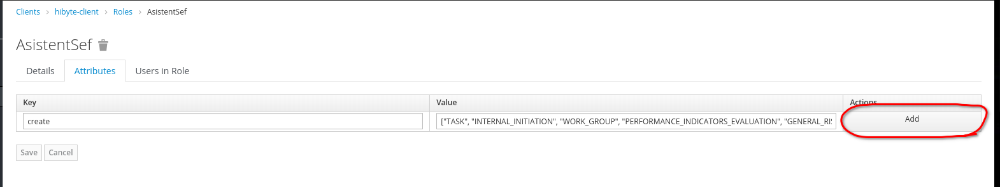

Once you're done filling in the attributes of a role, you need to click the *Save* button:
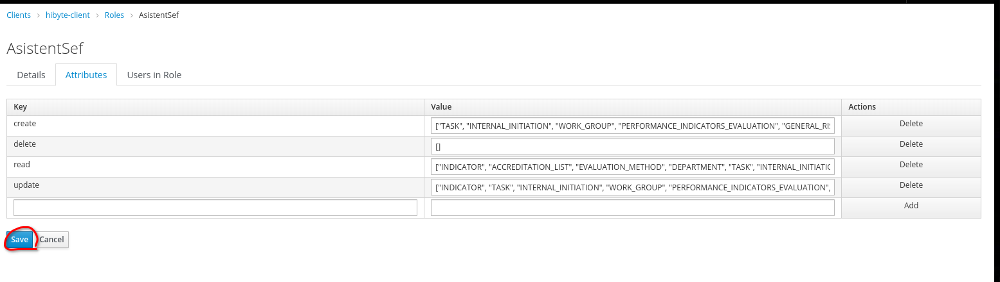

### All the required roles data
You need to repeat the steps from **Creating a role** for each of the roles. This section contains the data that you need for the creation of all the required roles.

**Note:** Attributes of a role have the following structure: `<action>: ["<resource_1>", "<resource_2>", ...]`. 

`<action>` can be one of `create`, `read`, `update` and `delete`.

`<resource_n>` can be one of `ACCOUNT`, `ACCREDITATION_LIST`, `ACTIVITY`, `APPOINTMENT`, `ASSET`, `CATEGORY`, `CAPESARO_SYNC`, `CLINICAL_RISK`, `COMMITTEE`, `DEFAULT_DOCUMENTS`, `DEPARTMENT`, `DONE_PROCEDURE`, `EVALUATION_METHOD`, `EXTERNAL_INITIATION`, `GENERAL_RISK`, `HOSPITAL`, `INDICATOR`, `INTERNAL_INITIATION`, `OBJECTIVE`, `PERFORMANCE_INDICATORS_EVALUATION`, `PROCEDURE`, `REQUIREMENT`, `SCIM_DEVELOPMENT`, `SCIM_SELF_ASSESSMENT`, `STATUS`, `TASK`, `WORK_GROUP` and `ACCOUNT`.

#### AsistentSef
*Role name:* `AsistentSef`
*Attributes:*
- `create` = `["TASK", "INTERNAL_INITIATION", "WORK_GROUP", "PERFORMANCE_INDICATORS_EVALUATION", "GENERAL_RISK", "CLINICAL_RISK"]`

- `read` = `["INDICATOR", "ACCREDITATION_LIST", "EVALUATION_METHOD", "DEPARTMENT", "TASK", "INTERNAL_INITIATION", "EXTERNAL_INITIATION", "WORK_GROUP", "PERFORMANCE_INDICATORS_EVALUATION", "GENERAL_RISK", "CLINICAL_RISK", "ASSET"]`

- `update` = `["INDICATOR", "TASK", "INTERNAL_INITIATION", "WORK_GROUP", "PERFORMANCE_INDICATORS_EVALUATION", "GENERAL_RISK", "CLINICAL_RISK"]`

- `delete` = `[]`

#### Bmcsm
*Role name:* `Bmcsm`
*Attributes:* 
- `create` = `["DEPARTMENT", "COMMITTEE", "TASK", "INTERNAL_INITIATION", "WORK_GROUP", "PERFORMANCE_INDICATORS_EVALUATION", "GENERAL_RISK", "CLINICAL_RISK"]`

- `read` = `["INDICATOR", "ACCREDITATION_LIST", "EVALUATION_METHOD", "DEPARTMENT", "COMMITTEE", "TASK", "INTERNAL_INITIATION", "EXTERNAL_INITIATION", "WORK_GROUP", "PERFORMANCE_INDICATORS_EVALUATION", "GENERAL_RISK", "CLINICAL_RISK", "ASSET"]`

- `update` = `["DEPARTMENT", "COMMITTEE", "TASK", "INTERNAL_INITIATION", "WORK_GROUP", "PERFORMANCE_INDICATORS_EVALUATION", "GENERAL_RISK", "CLINICAL_RISK"]`

- `delete` = `[]`

#### ComitetulDirector
*Role name:* `ComitetulDirector`
*Attributes:* 
- `create` = `["TASK", "INTERNAL_INITIATION", "WORK_GROUP", "PERFORMANCE_INDICATORS_EVALUATION", "GENERAL_RISK", "CLINICAL_RISK"]`

- `read` = `["INDICATOR", "ACCREDITATION_LIST", "EVALUATION_METHOD", "DEPARTMENT", "COMMITTEE", "TASK", "INTERNAL_INITIATION", "EXTERNAL_INITIATION", "WORK_GROUP", "PERFORMANCE_INDICATORS_EVALUATION", "GENERAL_RISK", "CLINICAL_RISK", "ASSET"]`

- `update` = `["TASK", "INTERNAL_INITIATION", "WORK_GROUP", "PERFORMANCE_INDICATORS_EVALUATION", "GENERAL_RISK", "CLINICAL_RISK"]`

- `delete` = `[]`

#### ConsultantJunior
*Role name:* `ConsultantJunior` 
*Attributes:* 
- `create` = `["ACCREDITATION_LIST", "COMMITTEE", "TASK", "INTERNAL_INITIATION", "WORK_GROUP", "PERFORMANCE_INDICATORS_EVALUATION", "GENERAL_RISK", "CLINICAL_RISK"]`

- `read` = `["INDICATOR", "ACCREDITATION_LIST", "EVALUATION_METHOD", "DEPARTMENT", "COMMITTEE", "TASK", "INTERNAL_INITIATION", "EXTERNAL_INITIATION", "WORK_GROUP", "PERFORMANCE_INDICATORS_EVALUATION", "GENERAL_RISK", "CLINICAL_RISK", "ASSET"]`

- `update` = `["TASK", "INTERNAL_INITIATION", "WORK_GROUP", "PERFORMANCE_INDICATORS_EVALUATION", "GENERAL_RISK", "CLINICAL_RISK"]`

- `delete` = `[]`

#### ConsultantSenior
*Role name:* `ConsultantSenior`
*Attributes:* 
- `create` = `["ACCREDITATION_LIST", "EVALUATION_METHOD", "DEPARTMENT", "COMMITTEE", "TASK", "INTERNAL_INITIATION", "EXTERNAL_INITIATION", "WORK_GROUP", "PERFORMANCE_INDICATORS_EVALUATION", "GENERAL_RISK", "CLINICAL_RISK"]`

- `read` = `["INDICATOR", "ACCREDITATION_LIST", "EVALUATION_METHOD", "DEPARTMENT", "COMMITTEE", "STATUS", "TASK", "INTERNAL_INITIATION", "EXTERNAL_INITIATION", "WORK_GROUP", "PERFORMANCE_INDICATORS_EVALUATION", "GENERAL_RISK", "CLINICAL_RISK", "OBJECTIVE", "ACTIVITY", "SCIM_DEVELOPMENT", "SCIM_SELF_ASSESSMENT", "ASSET"]`

- `update` = `["INDICATOR", "ACCREDITATION_LIST", "EVALUATION_METHOD", "DEPARTMENT", "COMMITTEE", "TASK", "INTERNAL_INITIATION", "EXTERNAL_INITIATION", "WORK_GROUP", "PERFORMANCE_INDICATORS_EVALUATION", "GENERAL_RISK", "CLINICAL_RISK"]`

- `delete` = `["INDICATOR", "ACCREDITATION_LIST", "EVALUATION_METHOD", "DEPARTMENT", "COMMITTEE", "STATUS", "TASK", "INTERNAL_INITIATION", "EXTERNAL_INITIATION", "WORK_GROUP", "GENERAL_RISK", "CLINICAL_RISK", "OBJECTIVE", "ACTIVITY", "SCIM_DEVELOPMENT", "SCIM_SELF_ASSESSMENT"]`

#### Instruit
*Role name:* `Instruit`
*Attributes:* 
- `create` = `[]`

- `read` = `["DEPARTMENT", "COMMITTEE", "TASK", "INTERNAL_INITIATION", "EXTERNAL_INITIATION", "ASSET"]`

- `update` = `["TASK", "INTERNAL_INITIATION", "EXTERNAL_INITIATION"]`

- `delete` = `[]`

#### ManagerSpital
*Role name:* `ManagerSpital`
*Attributes:* 
- `create` = `["EVALUATION_METHOD", "DEPARTMENT", "COMMITTEE", "TASK", "INTERNAL_INITIATION", "WORK_GROUP", "PERFORMANCE_INDICATORS_EVALUATION", "GENERAL_RISK", "CLINICAL_RISK"]`

- `read` = `["INDICATOR", "ACCREDITATION_LIST", "EVALUATION_METHOD", "DEPARTMENT", "COMMITTEE", "TASK", "INTERNAL_INITIATION", "EXTERNAL_INITIATION", "WORK_GROUP", "PERFORMANCE_INDICATORS_EVALUATION", "GENERAL_RISK", "CLINICAL_RISK", "ASSET"]`

- `update` = `["EVALUATION_METHOD", "DEPARTMENT", "COMMITTEE", "TASK", "INTERNAL_INITIATION", "WORK_GROUP", "PERFORMANCE_INDICATORS_EVALUATION", "GENERAL_RISK", "CLINICAL_RISK"]`

- `delete` = `[]`

#### SefDepartament
*Role name:* `SefDepartament`
*Attributes:* 
- `create` = `["TASK", "INTERNAL_INITIATION", "WORK_GROUP", "PERFORMANCE_INDICATORS_EVALUATION", "GENERAL_RISK", "CLINICAL_RISK"]`

- `read` = `["INDICATOR", "ACCREDITATION_LIST", "DEPARTMENT", "COMMITTEE", "TASK", "INTERNAL_INITIATION", "WORK_GROUP", "GENERAL_RISK", "GENERAL_RISK", "CLINICAL_RISK", "ASSET"]`

- `update` = `["TASK", "INTERNAL_INITIATION", "WORK_GROUP", "PERFORMANCE_INDICATORS_EVALUATION", "GENERAL_RISK", "CLINICAL_RISK"]`

- `delete` = `[]`

#### TestAdmin
*Role name:* `TestAdmin`
*Attributes:* 
- `create` = `["ACCOUNT","ACCREDITATION_LIST", "ACTIVITY", "APPOINTMENT", "ASSET", "CATEGORY", "CLINICAL_RISK", "COMMITTEE", "DEPARTMENT", "DONE_PROCEDURE", "EVALUATION_METHOD", "EXTERNAL_INITIATION", "GENERAL_RISK", "HOSPITAL", "INDICATOR", "INTERNAL_INITIATION", "OBJECTIVE", "PERFORMANCE_INDICATORS_EVALUATION", "PROCEDURE", "REQUIREMENT", "SCIM_DEVELOPMENT", "SCIM_SELF_ASSESSMENT", "STATUS", "TASK", "WORK_GROUP"]`

- `read` = `["ACCREDITATION_LIST", "ACTIVITY", "APPOINTMENT", "ASSET", "CATEGORY", "CLINICAL_RISK", "COMMITTEE", "DEPARTMENT", "DONE_PROCEDURE", "EVALUATION_METHOD", "EXTERNAL_INITIATION", "GENERAL_RISK", "HOSPITAL", "INDICATOR", "INTERNAL_INITIATION", "OBJECTIVE", "PERFORMANCE_INDICATORS_EVALUATION", "PROCEDURE", "REQUIREMENT", "SCIM_DEVELOPMENT", "SCIM_SELF_ASSESSMENT", "STATUS", "TASK", "WORK_GROUP"]`

- `update` = `["ACCREDITATION_LIST", "ACTIVITY", "APPOINTMENT", "ASSET", "CAPESARO_SYNC", "CATEGORY", "CLINICAL_RISK", "COMMITTEE", "DEPARTMENT", "DONE_PROCEDURE", "EVALUATION_METHOD", "EXTERNAL_INITIATION", "GENERAL_RISK", "HOSPITAL", "INDICATOR", "INTERNAL_INITIATION", "OBJECTIVE", "PERFORMANCE_INDICATORS_EVALUATION", "PROCEDURE", "REQUIREMENT", "SCIM_DEVELOPMENT", "SCIM_SELF_ASSESSMENT", "STATUS", "TASK", "WORK_GROUP", "DEFAULT_DOCUMENTS"]`

- `delete` = `["ACCREDITATION_LIST", "ACTIVITY", "APPOINTMENT", "ASSET", "CATEGORY", "CLINICAL_RISK", "COMMITTEE", "DEPARTMENT", "DONE_PROCEDURE", "EVALUATION_METHOD", "EXTERNAL_INITIATION", "GENERAL_RISK", "HOSPITAL", "INDICATOR", "INTERNAL_INITIATION", "OBJECTIVE", "PERFORMANCE_INDICATORS_EVALUATION", "PROCEDURE", "REQUIREMENT", "SCIM_DEVELOPMENT", "SCIM_SELF_ASSESSMENT", "STATUS", "TASK", "WORK_GROUP"]`

#### UtilizatorSimplu
*Role name:* `UtilizatorSimplu`
*Attributes:* 
- `create` = `["TASK", "GENERAL_RISK", "ASSET"]`

- `read` = `["INDICATOR", "ACCREDITATION_LIST", "EVALUATION_METHOD", "DEPARTMENT", "COMMITTEE", "TASK", "INTERNAL_INITIATION", "EXTERNAL_INITIATION", "WORK_GROUP", "PERFORMANCE_INDICATORS_EVALUATION", "GENERAL_RISK", "CLINICAL_RISK", "ASSET"]`

- `update` =  `["INDICATOR", "WORK_GROUP", "PERFORMANCE_INDICATORS_EVALUATION", "GENERAL_RISK", "CLINICAL_RISK"]`

- `delete` = `[]`

### Creating the base role
The base role is a role called `Hibyte` that all the users *MUST* have assigned to them. This role allows the account to which it is assigned to to access Keycloak's REST API.

First off, you need to create a new role that's called `Hibyte` and after saving it you need to enable *Composite Roles* on it:
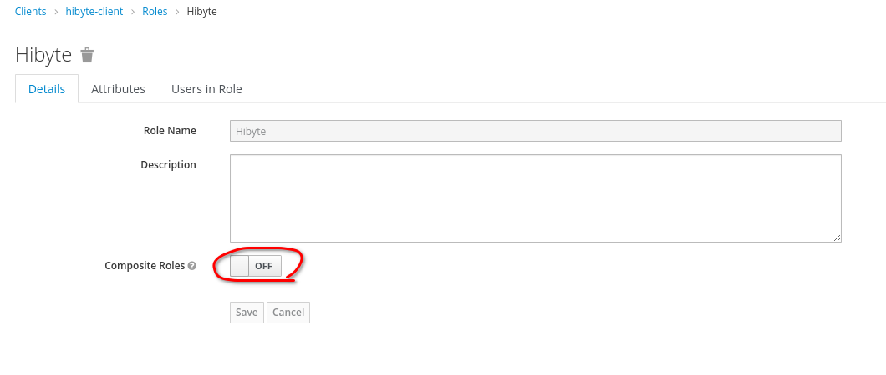

After enabling *Composite Roles*, click on the *Client Roles* dropdown:
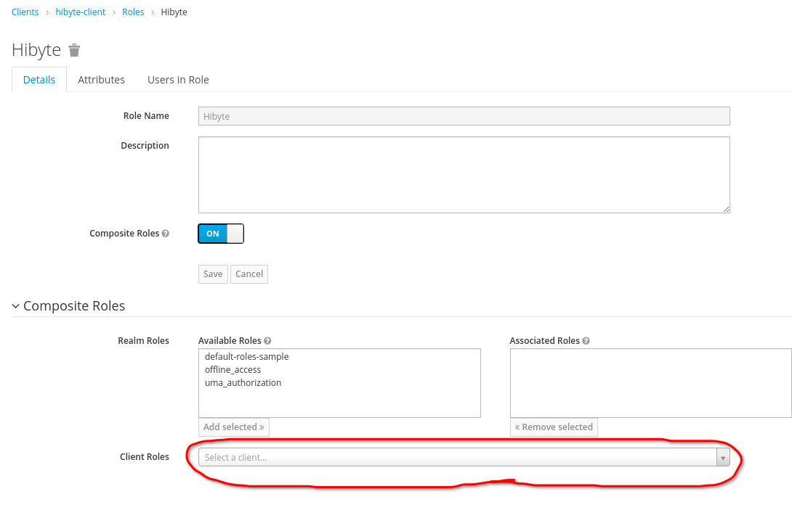

And select the *realm-management* entry:
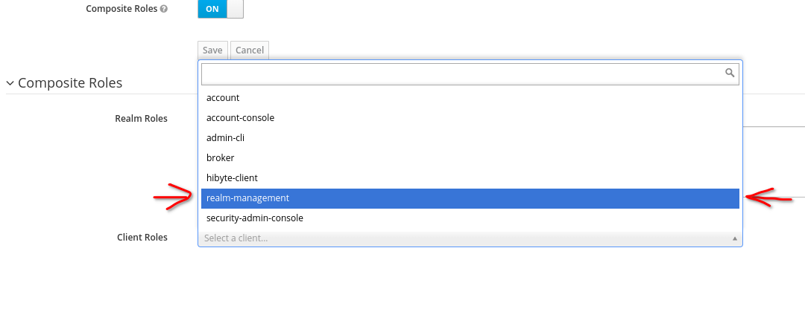

Next up, select all the entries from the *Available Roles* section (you can do it by clicking on the first entry, scrolling down to the last one and shift-clicking on the last entry) and click on the *Add selected >>* button:
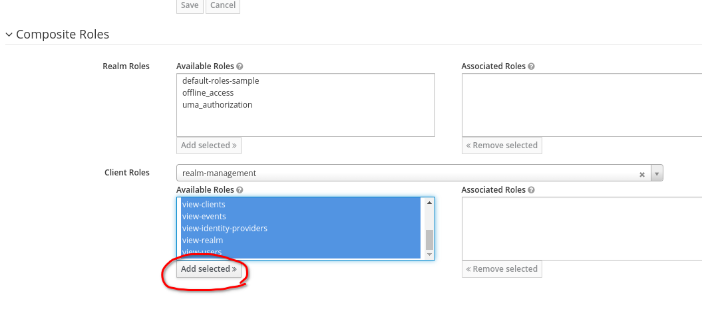

### Creating the base admin account
Now that the roles are set up, you need to create an admin account, which will be used when importing data from a Space One MediQ instance.

To do this, you first need to navigate to the *Users* section of the side nav and click on the *Add user* button:
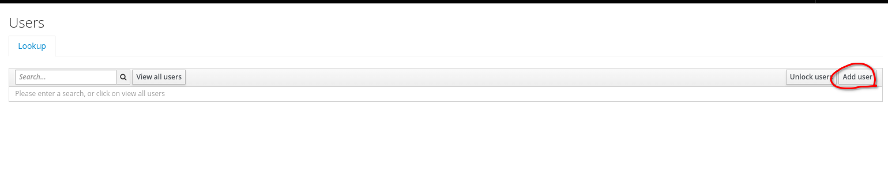

Fill in the details with the following values and click on the *Save* button:
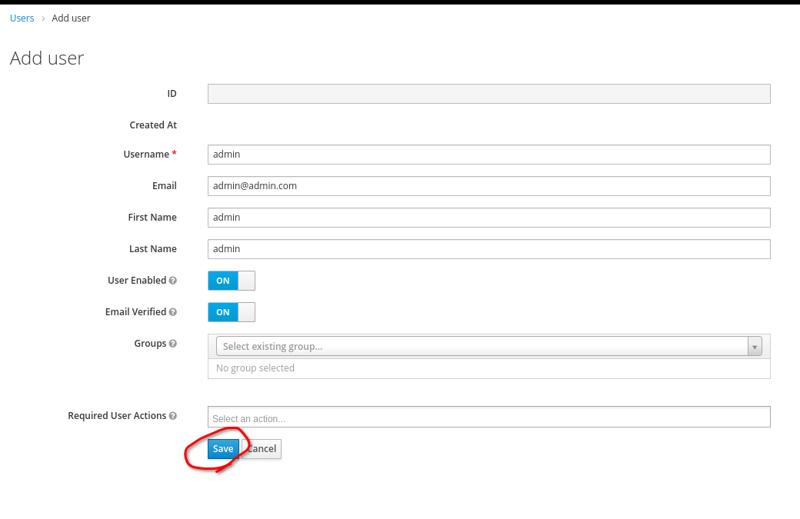

Finally, you need to set the password of the admin account. You can do this by navigating to the *Credentials* tab and filling in the details as follows:
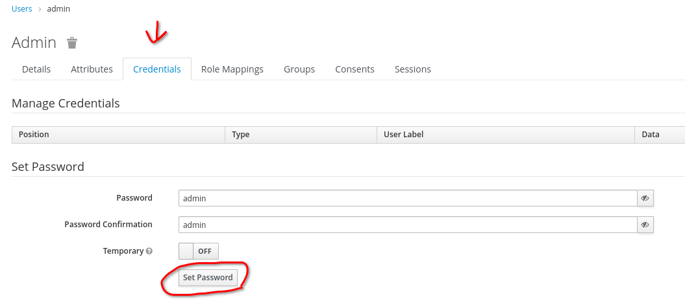

### Admin account roles
Now you need to set the admin account's roles. You can do this by going to the account's *Role Mappings* and selecting *hibyte-client* in the *Client Roles* dropdown:
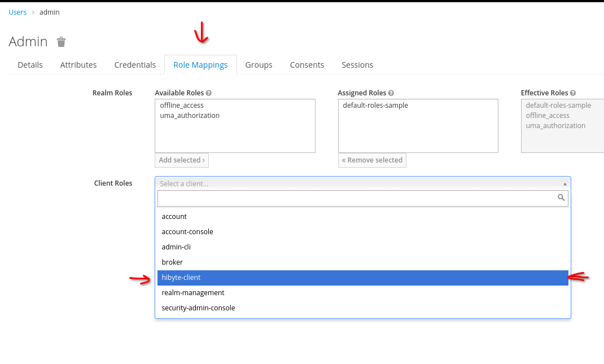

Select the *Hibyte* and *TestAdmin* roles and then click the *Add selected >>* button to add the two roles:
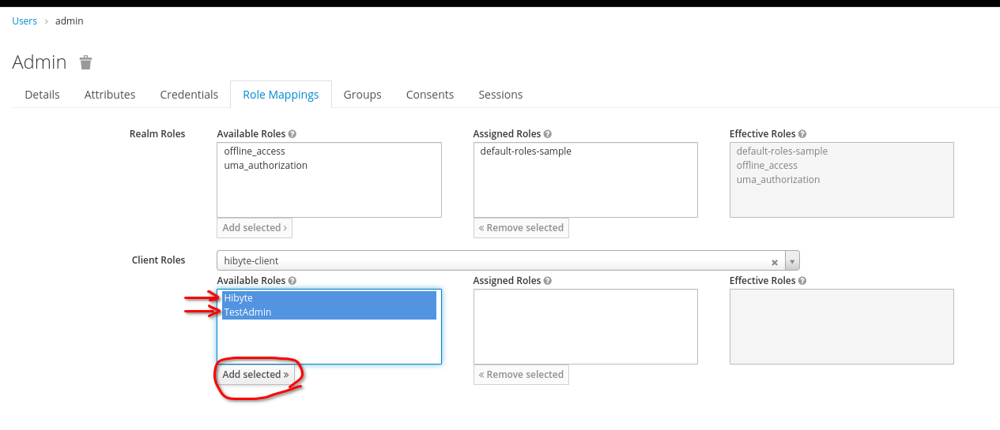

## Instance data import
In order to import data from an Space One instance you need to do the following requests to the deployed instance of the backend:
- A request to get an access token, which you will use to authorize the import request

Method: `POST`
URL: `https://keycloak.hq-hydra.hibyte.ro/auth/realms/{realm_name}/protocol/openid-connect/token`
Body Content Type: `x-www-form-urlencoded`
Body:
```
grant_type: password
client_id: hibyte-client
username: admin
password: admin
bearer-only: true
```

- A request that imports data from the Space One instance

Method: `GET`
URL: `{instance_URL}/api/import`

### Data import request failure
In case the import request fails, you need to do some changes to the Space One data model of the instance from where you want to import data:
- change `generalRisc.id` to `generalRisc.cod`
- change `objective.id` to `objective.cod`
- change `activity.id` to `activity.cod`
- make sure all the item links are ID for  `indicator`
- change `department.id` to `department.cod`
- make sure all the item links are ID for `generalRisk`
- change `generalRisk.cod` to `generalRisk.nr`
- make sure all the item links are ID for `clinicalRisk`
- - make sure all the item links are ID for `indicatorComment`